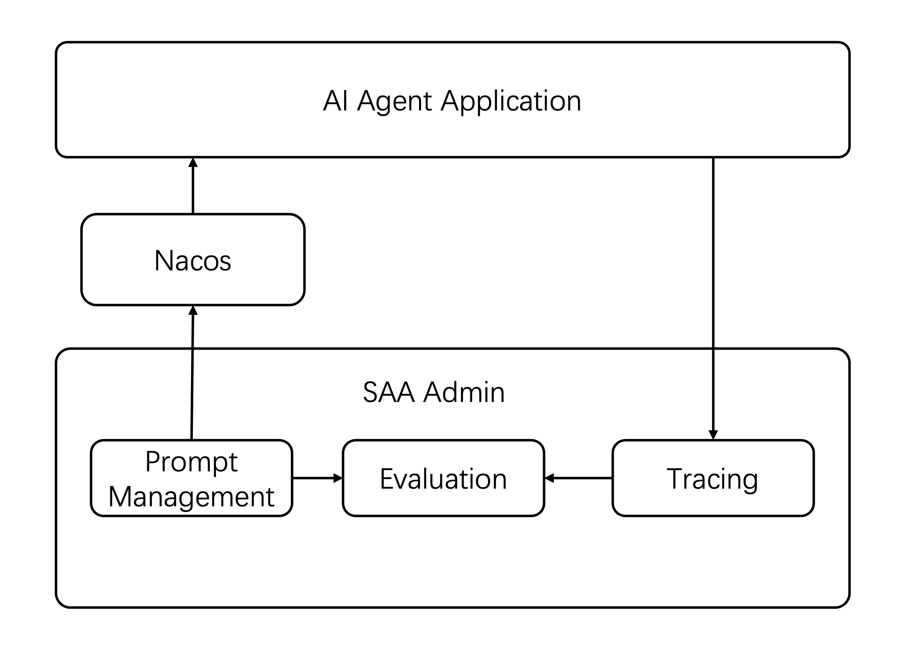

# Spring AI Alibaba Admin

> Spring AI Alibaba Repo: https://github.com/alibaba/spring-ai-alibaba
>
> Spring AI Alibaba Website: https://java2ai.com
>
> Spring AI Alibaba Website Repo: https://github.com/springaialibaba/spring-ai-alibaba-website

English | [中文](./README-zh.md) 

## Project Background

Agent Studio is an AI Agent development and evaluation platform based on Spring AI Alibaba, designed to provide developers and enterprises with a complete AI Agent lifecycle management solution. The platform supports a complete workflow from Prompt engineering, dataset management, evaluator configuration to experiment execution and result analysis, helping users quickly build, test, and optimize AI Agent applications.

## Core Features

### 🤖 Prompt Management
- **Prompt Template Management**: Create, update, and delete Prompt templates
- **Version Control**: Support for Prompt version management and history tracking
- **Real-time Debugging**: Provide online Prompt debugging and streaming responses
- **Session Management**: Support for multi-turn conversation session management

### 📊 Dataset Management
- **Dataset Creation**: Support for importing and creating datasets in multiple formats
- **Version Management**: Dataset version control and history management
- **Data Item Management**: Fine-grained data item CRUD operations
- **Create from Trace**: Support for creating datasets from OpenTelemetry trace data

### ⚖️ Evaluator Management
- **Evaluator Configuration**: Support for creating and configuring various evaluators
- **Template System**: Provide evaluator templates and custom evaluation logic
- **Debugging Features**: Support for online evaluator debugging and testing
- **Version Management**: Evaluator version control and release management

### 🧪 Experiment Management
- **Experiment Execution**: Automated execution of evaluation experiments
- **Result Analysis**: Detailed experiment result analysis and statistics
- **Experiment Control**: Support for starting, stopping, restarting, and deleting experiments
- **Batch Processing**: Support for batch experiment execution and result comparison

### 📈 Observability
- **Trace Tracking**: Integrated OpenTelemetry providing complete trace tracking
- **Service Monitoring**: Support for service list and overview statistics
- **Trace Analysis**: Provide detailed Trace details and Span analysis

### 🔧 Model Configuration
- **Multi-model Support**: Support for mainstream AI models including OpenAI, DashScope, DeepSeek
- **Configuration Management**: Unified configuration and management of model parameters
- **Dynamic Switching**: Support for dynamic updates of model configuration at runtime

## System Architecture

### Overall Architecture



## 🚀 Quick Start

### Prerequisites
- 🐳 **Docker** (for containerized deployment) + **Docker Compose**: 2.0+
- ☕ **Java 17+** (for source code execution) + **Maven**: 3.8+
- 🌐 **AI Model Provider API Keys**, supporting OpenAI, DashScope, DeepSeek

### Running from Source Code

#### 1. Clone the Project

```bash
git clone https://github.com/spring-ai-alibaba/spring-ai-alibaba-admin.git
cd admin
```

#### 2. Configure Your API Keys
Modify the model configuration in `spring-ai-alibaba-admin-server/model-config.yaml` according to your model provider.
- If you use DashScope, please refer to the model-config-dashscope.yaml template for configuration
- If you use DeepSeek, please refer to the model-config-deepseek.yaml template for configuration
- If you use OpenAI, please refer to the model-config-openai.yaml template for configuration
> 💡 **Get Your DashScope API Key**: Visit [Alibaba Cloud Bailian Console](https://bailian.console.aliyun.com/?tab=model#/api-key) to get a free API key.

#### 3. Nacos Configuration (Optional)
If you need to modify the Nacos address, please update the configuration in the `spring-ai-alibaba-admin-server/src/main/resources/application.yml` file
```yaml
nacos:
  server-addr: ${nacos-address}
```

### 4. Start SAA Admin
Execute the startup script in the root directory. This script will help you start the database-related services

```bash
sh start.sh
```
Start the application in the spring-ai-alibaba-admin-server directory
```bash
mvn spring-boot:run
```

### 5. Access the Application

Open your browser and visit http://localhost:8080 to use the SAA Admin platform.

At this point, you can already manage, debug, evaluate, and observe prompts on the platform. If you expect your Spring AI Alibaba Agent application to integrate with Nacos for prompt loading and dynamic updates, and observe the online running status, you can refer to step 6 to configure your AI Agent application.

### 6. Connect Your AI Agent Application
In your Spring AI Alibaba Agent application, add the following dependencies
```xml
<dependencies>
    <!-- Introduce spring ai alibaba agent nacos proxy module -->
    <dependency>
        <groupId>com.alibaba.cloud.ai</groupId>
        <artifactId>spring-ai-alibaba-agent-nacos</artifactId>
        <version>{spring.ai.alibaba.version}</version>
    </dependency>

    <!-- Introduce observability module -->

    <dependency>
        <groupId>com.alibaba.cloud.ai</groupId>
        <artifactId>spring-ai-alibaba-autoconfigure-arms-observation</artifactId>
        <version>{spring.ai.alibaba.version}</version>
    </dependency>
    
    
    <!-- For implementing various OTel related components, such as automatic loading of Tracer, Exporter -->
    <dependency>
        <groupId>org.springframework.boot</groupId>
        <artifactId>spring-boot-starter-actuator</artifactId>
    </dependency>
    
    <!-- For connecting micrometer generated metrics to otlp format -->
    <dependency>
        <groupId>io.micrometer</groupId>
        <artifactId>micrometer-registry-otlp</artifactId>
    </dependency>
    
    <!-- For replacing micrometer underlying trace tracer with OTel tracer -->
    <dependency>
        <groupId>io.micrometer</groupId>
        <artifactId>micrometer-tracing-bridge-otel</artifactId>
    </dependency>
    
    <!-- For reporting spans generated by OTel tracer according to otlp protocol -->
    <dependency>
        <groupId>io.opentelemetry</groupId>
        <artifactId>opentelemetry-exporter-otlp</artifactId>
    </dependency>

    <dependency>
        <groupId>org.springframework.ai</groupId>
        <artifactId>spring-ai-autoconfigure-model-tool</artifactId>
        <version>1.0.0</version>
    </dependency>
</dependencies>
``` 

Specify Nacos address and promptKey
```yaml
    spring.ai.alibaba.agent.proxy.nacos.serverAddr={replace nacos address, example: 127.0.0.1:8848}
    spring.ai.alibaba.agent.proxy.nacos.username={replace nacos username, example: nacos}
    spring.ai.alibaba.agent.proxy.nacos.password={replace nacos password, example: nacos}
    spring.ai.alibaba.agent.proxy.nacos.promptKey={replace with promptKey, example: mse-nacos-helper} 
```

Set observability parameters

```yaml
    management.otlp.tracing.export.enabled=true
    management.tracing.sampling.probability=1.0
    management.otlp.tracing.endpoint=http://{admin address}:4318/v1/traces
    management.otlp.metrics.export.enabled=false
    management.otlp.logging.export.enabled=false
    management.opentelemetry.resource-attributes.service.name=agent-nacos-prompt-test
    management.opentelemetry.resource-attributes.service.version=1.0
    spring.ai.chat.client.observations.log-prompt=true
    spring.ai.chat.observations.log-prompt=true
    spring.ai.chat.observations.log-completion=true
    spring.ai.image.observations.log-prompt=true
    spring.ai.vectorstore.observations.log-query-response=true
    spring.ai.alibaba.arms.enabled=true
    spring.ai.alibaba.arms.tool.enabled=true
    spring.ai.alibaba.arms.model.capture-input=true
    spring.ai.alibaba.arms.model.capture-output=true
```

## License

This project is open source under the Apache License 2.0 license.

## Contributing

We welcome submitting Issues and Pull Requests to help improve the project.

 